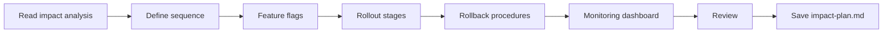

# Impact Plan

## Goal

Produce a concrete, incremental deployment plan with feature flags, progressive rollout stages, rollback procedures, and monitoring configuration.

## Rules

- No big bang deployments on critical flows
- Every change must be behind a feature flag with a documented TTL
- Rollback must be possible in under 5 minutes
- Monitoring must compare before/after baselines
- Criteria for progression between rollout phases must be measurable and binary
- Requirements started from $ARGUMENTS

## Quick Start

```text
Generate an impact plan for the architecture changes
```

## Workflow



### Step 1: Define Implementation Sequence

**Do:**

1. Read the architecture impact analysis from $ARGUMENTS or referenced files
2. Define implementation sequence ordered by risk (highest risk first):
   - Phase 1: Feature flags setup + infrastructure preparation
   - Phase 2: Data migrations (behind flags)
   - Phase 3: Code changes (behind flags)
   - Phase 4: Progressive rollout
   - Phase 5: Cleanup (remove flags, old code)

**Success criteria:** Sequence defined, risk-ordered

### Step 2: Document Feature Flags

**Do:**

1. For each feature flag, document:
   - Name (convention: `FEATURE_[MODULE]_[NAME]_ENABLED`)
   - Type (release, experiment, ops, permission)
   - Default value (always OFF)
   - TTL (planned removal date)
   - Rollback behavior

**Success criteria:** All flags documented with TTL and rollback behavior

### Step 3: Define Rollout & Rollback

**Do:**

1. Define progressive rollout stages:
   - Canary (1-5%) → 24-48h
   - Early Adopters (10-25%) → 3-5 days
   - Majority (50-75%) → 3-5 days
   - Full (100%)
2. Set progression criteria for each stage (error rate, latency, business metrics)
3. Document rollback procedure: step-by-step actions, estimated time, data loss assessment

**Success criteria:** Rollout stages defined with binary progression criteria, rollback procedure documented

### Step 4: Monitoring & Review

**Do:**

1. Define monitoring dashboard: before/after baseline, flag status, error tracking, alert thresholds
2. Present for review
3. **WAIT FOR USER APPROVAL**
4. Save as `aidd_docs/tasks/impact-plan.md`

**Success criteria:** Monitoring defined, impact plan validated and saved

## Resources

| Type  | Path                                      | Description          |
| ----- | ----------------------------------------- | -------------------- |
| Input | `aidd_docs/tasks/architecture-impact.md` | Impact analysis      |
| Input | `aidd_docs/memory/system_overview.md`    | System overview      |
