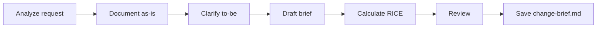

# Create Change Brief

## Goal

Clarify the gap between current behavior (as-is) and expected behavior (to-be) for a specific evolution on an existing system.

## Rules

- Always document the current behavior first, before describing the target
- Explicitly list what does NOT change
- Quantify business impact when possible
- One change brief per feature or coherent block of changes
- Requirements started from $ARGUMENTS

## Quick Start

```text
Create a change brief for adding multi-tenant support
```

## Workflow



### Step 1: Analyze & Document Current State

**Do:**

1. Analyze the change request from $ARGUMENTS
2. Document the current behavior (as-is) by reading relevant code
3. Ask clarifying questions about the expected behavior (to-be)
4. **WAIT FOR USER RESPONSE**

**Success criteria:** Current behavior documented, target behavior understood

### Step 2: Draft Change Brief

**Do:**

1. Draft the change brief with as-is, to-be, impact, and preserved behaviors
2. Calculate RICE score for prioritization
3. Identify regression risks

**Success criteria:** All sections completed, risks identified

### Step 3: Review & Save

**Do:**

1. Present for review
2. **WAIT FOR USER APPROVAL**
3. Save as `{{DOCS}}/tasks/YYYY-MM-DD-{change-name}/change-brief.md`

**Success criteria:** Change brief validated and saved

## Resources

| Type  | Path                                     | Description          |
| ----- | ---------------------------------------- | -------------------- |
| Input | `{{DOCS}}/memory/internal/system_overview.md`   | System overview      |

### Output Template

```markdown
# Change Brief - [Change Name]

## Context
[Origin of the request and justification]

## Current Behavior (As-Is)
[Factual description of the current flow]

## Expected Behavior (To-Be)
[Precise description of the target flow]

## What Does NOT Change
[Behaviors explicitly preserved]

## Business Impact
| Dimension | Impact |
| --- | --- |
| Users | [Who is affected] |
| Revenue | [Financial impact] |
| Operations | [Support impact] |
| Technical | [Debt reduced/added] |

## RICE Score
| Criterion | Score |
| --- | --- |
| Reach | /10 |
| Impact | /10 |
| Confidence | /10 |
| Effort | /10 |
| **RICE Score** | (R x I x C) / E |

## Identified Risks
[Potential regressions and side effects]
```
