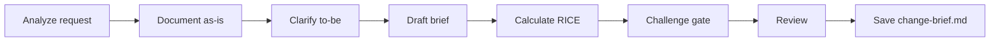

# Create Change Brief

## Goal

Clarify the gap between current behavior (as-is) and expected behavior (to-be) for a specific evolution on an existing system.

## Rules

- Always document the current behavior first, before describing the target
- Explicitly list what does NOT change
- Quantify business impact when possible
- One change brief per feature or coherent block of changes
- Requirements started from $ARGUMENTS
- **Standalone usage** — when not orchestrated, run `/challenge` after saving for adversarial review

## Quick Start

```text
Create a change brief for adding multi-tenant support
```

## Workflow



### Step 1: Analyze & Document Current State

**Do:**

1. Analyze the change request from $ARGUMENTS
2. Document the current behavior (as-is) by reading relevant code
3. Ask clarifying questions about the expected behavior (to-be)
4. **WAIT FOR USER RESPONSE**

**Success criteria:** Current behavior documented, target behavior understood

### Step 2: Draft Change Brief

**Do:**

1. Draft the change brief with as-is, to-be, impact, and preserved behaviors
2. Add **Success Criteria** — measurable conditions for the change to be considered done
3. Add **Scope Boundary** — what is explicitly in-scope and out-of-scope for this change
4. Add **Assumptions** — hypotheses taken as true; if invalidated, which sections must be revisited
5. Calculate RICE score for prioritization
6. Identify regression risks

**Success criteria:** All sections completed including success criteria, scope boundary, and assumptions; risks identified

### Step 3: Challenge Gate

**Do:**

1. Verify the change brief against these criteria:
   - As-is behavior documented from code/data, not assumed
   - To-be behavior is precise and testable (not vague aspirations)
   - What does NOT change is explicitly listed
   - RICE score calculated with realistic scores (not inflated)
   - Regression risks identified for each proposed change
   - Success criteria are measurable and binary

**Success criteria:** All criteria pass. Flag any failing criterion for user resolution before saving.


### Step 4: Review & Save

**Do:**

1. Present for review
2. **WAIT FOR USER APPROVAL**
3. Save as `{{DOCS}}/tasks/YYYY-MM-DD-{change-name}/change-brief.md`

**Success criteria:** Change brief validated and saved

## Resources

| Type     | Path                                          | Description          |
| -------- | --------------------------------------------- | -------------------- |
| Input    | `{{DOCS}}/memory/internal/system_overview.md` | System overview      |
| Template | `{{DOCS}}/templates/pm/change_brief.md`       | Change brief template |
