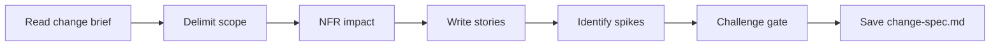

# Change Specification & Backlog

## Goal

Produce a detailed specification of what changes and what stays, with brownfield user stories that include regression protection. The output bridges the change brief with architecture and UX phases.

## Rules

- **Scope precision** — explicitly categorize changes: functional, technical, UX, data
- **Preservation is explicit** — list what does NOT change with references to system_overview flows
- **Regression protection** — every story includes "don't break X" acceptance criteria
- **INVEST-compliant** — every user story passes INVEST checklist
- **Gherkin acceptance** — acceptance criteria in Given/When/Then format
- **Brownfield estimation** — effort includes integration cost, not just intrinsic complexity
- **NFR impact** — assess performance, security, availability, scalability, maintainability
- Requirements started from $ARGUMENTS

## Quick Start

```text
Generate change specification from the login redesign change brief
```

## Workflow



### Step 1: Delimit Change Scope

**Do:**

1. Read change brief and system overview from Resources
2. If `prd.md` exists, read it to cross-reference existing greenfield user stories — use them to validate the preservation list and enrich regression criteria with product-level expectations
3. Categorize all changes by type:
   - **Functional**: new/modified behaviors
   - **Technical**: infrastructure, data model, API changes
   - **UX**: new/modified screens, flows, components
   - **Data**: migrations, new entities, schema changes
4. Explicitly list what does NOT change — reference preserved flows from system_overview by name
5. For each change, note the impacted module(s) from system_overview

**Success criteria:** Complete change inventory with preservation list

### Step 2: NFR Impact & Stories

**Do:**

1. Assess NFR impact matrix:
   - **Performance**: baseline → risk from change → mitigation
   - **Security**: current state → impact → audit needed?
   - **Availability**: external dependency added?
   - **Scalability**: volume impact predicted?
   - **Maintainability**: test coverage budget?
2. Write user stories in brownfield format:
   - Format: "En tant que [persona], je veux [action] afin de [benefit]"
   - Each story passes INVEST checklist
   - Acceptance criteria in Gherkin (Given/When/Then)
   - **Each story includes regression criteria**: "And [existing behavior X] still works as documented in system_overview"
   - Estimate with integration cost (not just intrinsic)
3. Identify brownfield spikes:
   - **Performance spike**: will change degrade under load?
   - **Debt spike**: can module accept this feature?
   - **Migration spike**: zero-downtime strategy viable?
   - **Compatibility spike**: API backward-compatible?
   - Each spike is time-boxed (1-2 days) with a clear deliverable

**Success criteria:** NFR matrix complete, all stories INVEST-compliant with Gherkin + regression criteria, spikes identified

### Step 3: Challenge Gate

**Do:**

1. Verify all sections present:
   - Change scope by category (functional, technical, UX, data)
   - Preservation list (what doesn't change)
   - NFR impact matrix
   - User stories with Gherkin acceptance criteria
   - Regression criteria per story
   - Brownfield spikes (if any)
2. Verify format: Gherkin syntax correct, INVEST checklist referenced, preservation references system_overview

**Success criteria:** All sections present and format requirements met. If any section is missing or format is wrong, STOP — fix it.

### Step 4: Save

**Do:**

1. Save as `{{DOCS}}/tasks/YYYY-MM-DD-{change-name}/change-spec.md`

**Success criteria:** File saved and accessible

## Resources

| Type  | Path                                          | Description                              |
| ----- | --------------------------------------------- | ---------------------------------------- |
| Input | `{{DOCS}}/memory/internal/system_overview.md` | Current system state                     |
| Input | `{{DOCS}}/memory/internal/prd.md`             | Greenfield user stories (if available)   |
| Input | Change brief from current task folder         | Change scope and rationale               |
