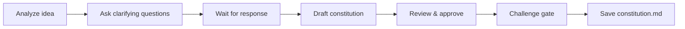

# Create Constitution

## Goal

Transform a raw idea into a structured constitution document that frames the project vision, measurable objectives, and critical constraints.

## Rules

- Focus on strategic framing, not implementation details
- Keep the constitution to 1-2 pages maximum
- Every objective must be measurable
- Constraints must be binary (negotiable or not)
- Anti-over-engineering rules are mandatory
- Requirements started from $ARGUMENTS
- **Standalone usage** — when not orchestrated, run `/challenge` after saving for adversarial review

## Quick Start

```text
Create a constitution for my SaaS project management tool
```

## Workflow



### Step 1: Analyze & Clarify

**Do:**

1. Analyze the idea and business context from $ARGUMENTS
2. Ask clarifying questions about vision, target users, and known constraints
3. **WAIT FOR USER RESPONSE**

**Success criteria:** All key dimensions understood (vision, users, constraints, metrics)

### Step 2: Draft Constitution

**Do:**

1. Draft the constitution with all sections using the template below
2. Present for review, highlighting any assumptions made
3. **WAIT FOR USER APPROVAL**

**Success criteria:** All sections completed, assumptions flagged

### Step 3: Challenge Gate

**Do:**

1. Verify the constitution against these criteria:
   - Vision clear in one sentence — a new team member understands the project without additional context
   - NSM is measurable, actionable, and not a vanity metric (not page views, not downloads)
   - Non-negotiable constraints listed with consequences if violated
   - Anti-over-engineering rules are concrete and actionable (not generic platitudes)
   - Key stakeholders identified with what each validates

**Success criteria:** All criteria pass. Flag any failing criterion for user resolution before saving.


### Step 4: Save

**Do:**

1. Save as `{{DOCS}}/memory/internal/constitution.md`

**Success criteria:** File saved and accessible

## Resources

| Type     | Path                                      | Description                  |
| -------- | ----------------------------------------- | ---------------------------- |
| Template | `{{DOCS}}/templates/pm/constitution.md`  | Constitution template |
