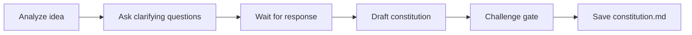

# Create Constitution

## Goal

Transform a raw idea into a structured constitution document that frames the project vision, measurable objectives, and critical constraints.

## Rules

- ALWAYS focus on strategic framing, not implementation details
- Keep the constitution high-level and timeless, it should guide decision-making for the entire project lifecycle, not just the next steps
- **Business language** — write in business/product terms, never in technical terms (no stack, no framework, no infra). Technical choices belong in architecture-decision.
- **No solutioning** — describe the problem and constraints, not the solutions. "Support 10k simultaneous users" yes, "Use Redis for caching" no.
- **User-centric framing** — objectives and constraints must be expressed from the user's or business's perspective, not the developer's
- Every objective must be measurable
- Constraints must be binary (negotiable or not)
- Anti-over-engineering rules are mandatory
- Requirements started from $ARGUMENTS

## Quick Start

```text
Create a constitution for my SaaS project management tool
```

## Workflow



### Step 1: Analyze & Clarify

**Do:**

1. Analyze the idea and business context from $ARGUMENTS
2. Ask clarifying questions focused on: vision, target users, business model, market context, success criteria, and known constraints. Stay at business/product level — no technical questions at this stage.
3. **WAIT FOR USER RESPONSE**

**Success criteria:** All key dimensions understood (vision, users, business constraints, success metrics)

### Step 2: Draft Constitution

**Do:**

1. Read the template from Resources. Follow its exact structure — same headings, same table columns, same formats. Do not add, remove, or rename sections.
2. Fill in each placeholder (`[...]`) with project-specific content
3. Highlight any assumptions made

**Success criteria:** All template sections completed with exact heading names preserved, assumptions flagged

### Step 3: Challenge Gate

**Do:**

1. Read the template from Resources
2. Verify every template section exists in the output with the exact same heading name and no section was added beyond what the template defines
3. Verify format requirements: (none — structure only for this skill)

**Success criteria:** All template sections present and format requirements met. If any section is missing or any format is wrong, STOP — fix it. Do NOT proceed until structurally complete.

### Step 4: Save

**Do:**

1. Save as `{{DOCS}}/memory/internal/constitution.md`

**Success criteria:** File saved and accessible

## Resources

| Type     | Path                                      | Description                  |
| -------- | ----------------------------------------- | ---------------------------- |
| Template | `{{DOCS}}/templates/pm/constitution.md`  | Constitution template |
