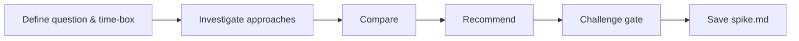

# Spike

## Goal

Answer a single, precise question through a time-boxed investigation. Produce a recommendation (GO / NO-GO) with evidence, not production code.

## Rules

- **One question** — a spike answers exactly ONE question. If there are multiple unknowns, run multiple spikes.
- **Time-boxed** — define a max duration before starting. When the time-box expires, deliver findings as-is.
- **At least 2 approaches** — always compare alternatives. A spike that validates only one path is confirmation bias, not investigation.
- **Evidence over opinion** — findings must be backed by data, prototypes, benchmarks, documentation, or expert references.
- **Recommendation, not code** — the deliverable is a decision with justification. Any prototype code is throwaway.
- **Feed the next step** — the spike must explicitly state which deliverable or decision it unblocks.
- Requirements started from $ARGUMENTS

## Quick Start

```text
Spike: can we use WebSockets for real-time updates given our infrastructure constraints?
```

## Workflow



### Step 1: Frame the question

**Do:**

1. Extract the uncertainty from $ARGUMENTS
2. Formulate a single, binary-answerable question (can we...? should we...? is it feasible to...?)
3. Define the time-box and success criteria
4. Identify which deliverable or decision is blocked by this uncertainty

**Success criteria:** One clear question, time-box defined, blocker identified

### Step 2: Investigate

**Do:**

1. Research at least 2 alternative approaches
2. For each approach: describe it, document findings, list pros/cons
3. Use evidence: documentation, benchmarks, proof-of-concept, expert references
4. Stay within the time-box — breadth over depth

**Success criteria:** At least 2 approaches investigated with evidence-based findings

### Step 3: Compare & Recommend

**Do:**

1. Read the template from Resources. Follow its exact structure — same headings, same table columns, same formats. Do not add, remove, or rename sections.
2. Fill the comparison table (feasibility, effort, risk, alignment with constraints)
3. State a clear verdict: GO approach X / NO-GO / Need more investigation
4. Document residual risks and the next step this spike feeds into

**Success criteria:** Comparison table filled, verdict stated, next step identified

### Step 4: Challenge Gate

**Do:**

1. Read the template from Resources
2. Verify every template section exists in the output with the exact same heading name and no section was added beyond what the template defines
3. Verify format requirements:
   - At least 2 approaches documented
   - Comparison table present
   - Verdict is GO / NO-GO / Need more investigation (not "maybe" or "it depends")

**Success criteria:** All template sections present and format requirements met. If any section is missing or any format is wrong, STOP — fix it. Do NOT proceed until structurally complete.

### Step 5: Save

**Do:**

1. Save as `{{DOCS}}/tasks/{context}/spike-{topic}.md`

**Success criteria:** File saved and accessible

## Resources

| Type     | Path                               | Description    |
| -------- | ---------------------------------- | -------------- |
| Template | `{{DOCS}}/templates/aidd/spike.md` | Spike template |
