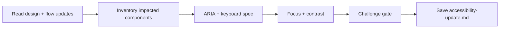

# Update Accessibility Specifications

## Goal

Produce actionable accessibility specifications for components that are new or modified by the change: ARIA roles, keyboard navigation, focus management, and contrast requirements. The output covers only the change scope, not the full product.

## Rules

- **Change-scoped** — only specify components that are new or modified by the change, not the full product
- WCAG AA is the minimum — document where AAA is achievable
- Every interactive component must have keyboard navigation specified
- ARIA roles and attributes must be explicit, not implied
- Focus management must cover modals, drawers, dynamic content introduced by the change
- **Reference design tokens, do not redefine them** — reference token names from design-system-update or existing design_system.md
- **Preservation awareness** — note where new components interact with existing accessible patterns
- Requirements started from $ARGUMENTS

## Quick Start

```text
Generate accessibility specs for the login redesign components
```

## Workflow



### Step 1: Inventory Impacted Components

**Do:**

1. Read design system update and flow update from Resources
2. If existing accessibility_spec.md exists, read it for context on current a11y patterns
3. List every component that is new or modified:
   - **New components**: introduced by design-system-update
   - **Modified components**: existing components with changed behavior from flow updates
4. Classify each by interaction pattern (clickable, editable, navigable, expandable)
5. Note where new components must integrate with existing accessibility patterns

**Success criteria:** Complete inventory of impacted components with classification

### Step 2: ARIA, Keyboard & Focus Specification

**Do:**

1. For each impacted component, specify:
   - **ARIA roles**: `role`, `aria-label`, `aria-describedby`, `aria-expanded`, `aria-live`, etc.
   - **Keyboard navigation**: which keys do what (Tab, Enter, Escape, Arrow keys, Space)
   - **Keyboard sequence**: expected tab order within the changed area
2. Define focus management for new dynamic elements:
   - Focus trap for new modals/drawers
   - Focus restoration on close
   - Focus movement for new dynamic content
3. Verify contrast ratios for new design tokens:
   - Text on background: minimum 4.5:1 (AA)
   - Large text: minimum 3:1 (AA)
   - UI components: minimum 3:1 (AA)
4. Reference token names from design-system-update (not raw hex values)

**Success criteria:** All impacted components have ARIA, keyboard, focus, and contrast specified

### Step 3: Challenge Gate

**Do:**

1. Verify all sections present:
   - Impacted component inventory
   - ARIA specification per component
   - Keyboard navigation per component
   - Focus management rules for new dynamic elements
   - Contrast verification referencing design tokens
2. Verify format: ARIA roles explicit, contrast references tokens not hex, keyboard sequences complete

**Success criteria:** All sections present and format requirements met. If any section is missing or format is wrong, STOP — fix it.

### Step 4: Save

**Do:**

1. Save as `{{DOCS}}/tasks/YYYY-MM-DD-{change-name}/accessibility-update.md`

**Success criteria:** File saved and accessible

## Resources

| Type     | Path                                              | Description                                     |
| -------- | ------------------------------------------------- | ----------------------------------------------- |
| Input    | Design system update from current task folder     | New/modified components and tokens              |
| Input    | User flows update from current task folder        | Impacted flows with all states                  |
| Input    | `{{DOCS}}/memory/internal/accessibility_spec.md`  | Existing a11y spec (if available, for patterns) |
| Template | `{{DOCS}}/templates/ux/accessibility_spec.md`     | Accessibility template (section structure)      |
