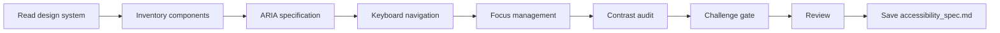

# Accessibility Spec

## Goal

Produce an actionable accessibility specification for every component in the design system: ARIA roles and attributes, keyboard navigation sequences, focus management rules, and contrast requirements. The output is implementation-ready for developers.

## Rules

- WCAG AA is the minimum — document where AAA is achievable
- Every interactive component must have keyboard navigation specified
- ARIA roles and attributes must be explicit, not implied
- Focus management must cover modals, drawers, dynamic content
- Contrast ratios must be verified against design tokens
- Requirements started from $ARGUMENTS
- **Standalone usage** — when not orchestrated, run `/challenge` after saving for adversarial review

### Scope Boundary

**Reference design tokens, do not redefine them.** When specifying contrast ratios, reference the token name from `design_system.md` (e.g., "color.primary on color.surface") rather than restating hex values. This ensures a single source of truth for visual tokens.

## Quick Start

```text
Generate accessibility specs from our design system
```

## Workflow



### Step 1: Inventory Interactive Components

**Do:**

1. Read the design system from $ARGUMENTS or referenced files
2. List every interactive component (buttons, inputs, modals, navigation, tabs, dropdowns, etc.)
3. Classify each component by interaction pattern (clickable, editable, navigable, expandable)

**Success criteria:** Complete inventory of interactive components with classification

### Step 2: ARIA & Keyboard Specification

**Do:**

1. For each component, specify:
   - **ARIA roles**: `role`, `aria-label`, `aria-describedby`, `aria-expanded`, `aria-live`, etc.
   - **Keyboard navigation**: which keys do what (Tab, Enter, Escape, Arrow keys, Space)
   - **Keyboard sequence**: the expected tab order and focus flow
2. Document compound widget patterns (combobox, menu, tabs, tree)

**Success criteria:** Every component has explicit ARIA roles and keyboard navigation

### Step 3: Focus Management & Contrast

**Do:**

1. Define focus management rules:
   - Focus trap for modals and drawers
   - Focus restoration on close
   - Focus movement for dynamic content (toasts, alerts, lazy-loaded items)
   - Skip links and landmark navigation
2. Verify contrast ratios against design tokens:
   - Text on background: minimum 4.5:1 (AA)
   - Large text: minimum 3:1 (AA)
   - UI components: minimum 3:1 (AA)
3. Document any exceptions or known limitations

**Success criteria:** Focus management rules defined, contrast ratios verified

### Step 4: Challenge Gate

**Do:**

1. Verify the accessibility spec against these criteria:
   - Every interactive component has explicit ARIA roles and attributes
   - Keyboard navigation specified for every interactive component
   - Focus management covers modals, drawers, and dynamic content
   - Contrast ratios verified against design tokens (4.5:1 text, 3:1 components)
   - WCAG AA minimum met across all components (AAA documented where achievable)
   - Scope boundary respected: references design tokens, does not redefine them

**Success criteria:** All criteria pass. Flag any failing criterion for user resolution before saving.


### Step 5: Review & Save

**Do:**

1. Present the accessibility spec for review
2. **WAIT FOR USER APPROVAL**
3. Save as `{{DOCS}}/memory/internal/accessibility_spec.md`

**Success criteria:** Accessibility spec validated and saved

## Resources

| Type     | Path                                              | Description              |
| -------- | ------------------------------------------------- | ------------------------ |
| Input    | `{{DOCS}}/memory/internal/design_system.md`       | Design system            |
| Input    | `{{DOCS}}/memory/internal/user_flows.md`          | User flows               |
| Template | `{{DOCS}}/templates/ux/accessibility_spec.md`     | Accessibility template   |
