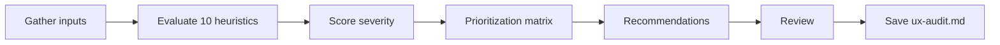

# UX Audit

## Goal

Evaluate an existing product against Nielsen's 10 usability heuristics. Produce a scored audit with severity levels and a prioritization matrix that ranks issues by impact and effort. The output is an actionable improvement backlog.

## Rules

- All 10 Nielsen heuristics must be evaluated — no shortcuts
- Severity scoring uses a 0-4 scale (0=not a problem, 4=usability catastrophe)
- Every issue must have a concrete recommendation, not just a diagnosis
- Prioritization uses impact vs effort matrix
- Evidence-based — cite specific screens, flows, or code patterns
- Requirements started from $ARGUMENTS

## Quick Start

```text
Audit the UX of our application
```

## Workflow



### Step 1: Gather Inputs

**Do:**

1. Read the codebase, screenshots, or existing documentation from $ARGUMENTS
2. Identify the key user flows to audit
3. List the screens and interactions to evaluate

**Success criteria:** Audit scope defined with specific flows and screens

### Step 2: Evaluate Nielsen's 10 Heuristics

**Do:**

1. Evaluate each heuristic with specific findings:
   - **H1 — Visibility of system status**: Does the system keep users informed?
   - **H2 — Match between system and real world**: Does it use user language?
   - **H3 — User control and freedom**: Can users undo and redo?
   - **H4 — Consistency and standards**: Are conventions followed?
   - **H5 — Error prevention**: Does the design prevent errors?
   - **H6 — Recognition rather than recall**: Is information visible vs memorized?
   - **H7 — Flexibility and efficiency of use**: Are there shortcuts for experts?
   - **H8 — Aesthetic and minimalist design**: Is information relevant?
   - **H9 — Help users recognize, diagnose, and recover from errors**: Are error messages helpful?
   - **H10 — Help and documentation**: Is help available when needed?
2. For each finding, document: location, description, evidence

**Success criteria:** All 10 heuristics evaluated with specific findings

### Step 3: Severity Scoring & Prioritization

**Do:**

1. Score each finding on a 0-4 severity scale:
   - 0: Not a usability problem
   - 1: Cosmetic — fix only if extra time
   - 2: Minor — low priority fix
   - 3: Major — high priority fix
   - 4: Catastrophe — must fix before release
2. Build a prioritization matrix (impact vs effort):
   - Quick wins: high impact, low effort
   - Strategic: high impact, high effort
   - Fill-ins: low impact, low effort
   - Deprioritize: low impact, high effort

**Success criteria:** All findings scored and plotted on the prioritization matrix

### Step 4: Review & Save

**Do:**

1. Present the audit report with findings, scores, and prioritized recommendations
2. **WAIT FOR USER APPROVAL**
3. Save as `{{DOCS}}/tasks/YYYY-MM-DD-{audit}/ux-audit.md`

**Success criteria:** UX audit validated and saved

## Resources

| Type  | Path                                            | Description              |
| ----- | ----------------------------------------------- | ------------------------ |
| Input | Codebase or screenshots                         | Product to audit         |
| Input | `{{DOCS}}/memory/internal/design_system.md`           | Design system (if exists)|
| Input | `{{DOCS}}/memory/internal/user_flows.md`              | User flows (if exists)   |
