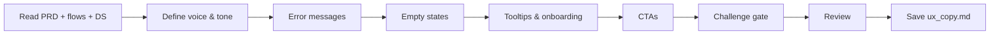

# UX Copy

## Goal

Produce a complete UX copy document covering voice & tone guidelines, error messages, empty states, tooltips, onboarding copy, and CTAs. All copy is structured for i18n with translation keys and follows a consistent tone throughout the product.

## Rules

- All copy must be i18n-ready with translation keys
- Voice & tone must be defined before any copy is written
- Error messages must be actionable — tell the user what to do, not just what went wrong
- Empty states must guide the user toward the next action
- No placeholder copy — every string is production-ready
- Requirements started from $ARGUMENTS
- **Standalone usage** — when not orchestrated, run `/challenge` after saving for adversarial review

### Scope Boundary

**This deliverable is the single source of truth for ALL user-facing text** — error messages, empty states, tooltips, onboarding copy, CTAs, confirmation messages, notification text.

Do NOT copy text from `design_system.md`. Instead, use the design system for structural context (which components exist, which states they have) and write the definitive copy here.

## Quick Start

```text
Generate UX copy from our PRD and user flows
```

## Workflow



### Step 1: Define Voice & Tone

**Do:**

1. Read the PRD, user flows, and design system from $ARGUMENTS or referenced files
2. Define the product voice (personality traits: professional, friendly, technical, casual, etc.)
3. Define tone variations by context:
   - Success: celebratory but not excessive
   - Error: empathetic and actionable
   - Empty state: encouraging and guiding
   - Onboarding: welcoming and clear
4. Provide do/don't examples for each tone

**Success criteria:** Voice & tone guidelines defined with concrete examples

### Step 2: Error Messages & Empty States

**Do:**

1. For each error identified in the user flows, write:
   - A clear, non-technical error message
   - An actionable recovery instruction
   - The translation key (e.g., `error.auth.invalid_credentials`)
2. For each empty state identified in the user flows, write:
   - A contextual message explaining why it's empty
   - A CTA guiding the user to populate the state
   - The translation key (e.g., `empty.projects.no_projects`)

**Success criteria:** All errors and empty states have production-ready copy with i18n keys

### Step 3: Tooltips, Onboarding & CTAs

**Do:**

1. Write tooltips for complex UI elements (max 1 sentence each)
2. Write onboarding copy for first-time user experience:
   - Welcome message
   - Step-by-step guidance
   - Progressive disclosure copy
3. Write CTAs for all primary actions:
   - Use action verbs (Create, Save, Send, not OK/Submit)
   - Ensure consistency across similar actions
4. All strings with translation keys

**Success criteria:** Complete copy set with i18n keys for tooltips, onboarding, CTAs

### Step 4: Challenge Gate

**Do:**

1. Verify the UX copy against these criteria:
   - Voice & tone defined with do/don't examples before any copy is written
   - All error messages are actionable (tell user what to do, not just what went wrong)
   - All empty states guide user toward the next action
   - All strings have i18n translation keys
   - Copy is production-ready (no placeholder text)
   - Tone consistent across all contexts (success, error, empty, onboarding)

**Success criteria:** All criteria pass. Flag any failing criterion for user resolution before saving.


### Step 5: Review & Save

**Do:**

1. Present the complete UX copy document for review
2. **WAIT FOR USER APPROVAL**
3. Save as `{{DOCS}}/memory/internal/ux_copy.md`

**Success criteria:** UX copy validated and saved

## Resources

| Type     | Path                                          | Description          |
| -------- | --------------------------------------------- | -------------------- |
| Input    | `{{DOCS}}/memory/internal/prd.md`             | Product requirements |
| Input    | `{{DOCS}}/memory/internal/user_flows.md`      | User flows           |
| Input    | `{{DOCS}}/memory/internal/design_system.md`   | Design system        |
| Template | `{{DOCS}}/templates/ux/ux_copy.md`            | UX copy template     |
