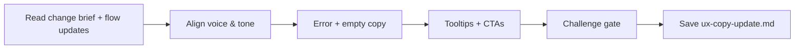

# Update UX Copy

## Goal

Produce UX copy for screens and states that are new or modified by the change: error messages, empty states, tooltips, onboarding copy, and CTAs. All copy follows existing voice & tone and is structured for i18n.

## Rules

- **Change-scoped** — only write copy for new or modified screens/states, not the full product
- All copy must be i18n-ready — every string MUST have a translation key
- **Tone consistency** — match existing voice & tone from ux_copy.md if available; if no existing copy exists, define voice & tone for the change scope
- Error messages must be actionable — tell user what to do, not just what went wrong
- Empty states must guide user toward next action
- No placeholder copy — every string is production-ready
- Requirements started from $ARGUMENTS

## Quick Start

```text
Generate UX copy for the login redesign change
```

## Workflow



### Step 1: Align Voice & Tone

**Do:**

1. Read change brief, flow updates, and design system update from Resources
2. If existing ux_copy.md exists, read its voice & tone section — all new copy must match
3. If no existing copy exists, define voice & tone for this change scope:
   - Product voice personality traits
   - Tone variations by context (success, error, empty, onboarding)
4. List all screens/states that need new or modified copy (from flow updates)

**Success criteria:** Voice & tone aligned, complete list of copy needs identified

### Step 2: Write Copy

**Do:**

1. For each new/modified error state (from flow updates):
   - Clear, non-technical error message
   - Actionable recovery instruction
   - Translation key (format: `error.{domain}.{type}`)
2. For each new/modified empty state:
   - Contextual message explaining why empty
   - CTA guiding user to populate
   - Translation key (format: `empty.{domain}.{context}`)
3. For new UI elements:
   - Tooltips (max 1 sentence, key: `tooltip.{domain}.{element}`)
   - CTAs with action verbs (key: `cta.{domain}.{action}`)
   - Confirmation/notification messages (key: `confirm.{domain}.{action}`)
4. If the change introduces onboarding for a new feature:
   - Welcome/introduction copy
   - Step-by-step guidance
   - Progressive disclosure copy

**Success criteria:** All new/modified screens have production-ready copy with i18n keys

### Step 3: Challenge Gate

**Do:**

1. Verify all sections present:
   - Voice & tone alignment (reference or definition)
   - Error messages with recovery actions
   - Empty states with CTAs
   - Tooltips, CTAs, confirmations as needed
   - All strings have i18n translation keys
2. Verify format: i18n keys follow naming convention, tone matches existing product copy

**Success criteria:** All sections present and format requirements met. If any section is missing or format is wrong, STOP — fix it.

### Step 4: Save

**Do:**

1. Save as `{{DOCS}}/tasks/YYYY-MM-DD-{change-name}/ux-copy-update.md`

**Success criteria:** File saved and accessible

## Resources

| Type     | Path                                          | Description                               |
| -------- | --------------------------------------------- | ----------------------------------------- |
| Input    | Change brief from current task folder         | Change scope and rationale                |
| Input    | User flows update from current task folder    | Impacted flows with all states            |
| Input    | Design system update from current task folder | New/modified components                   |
| Input    | `{{DOCS}}/memory/internal/ux_copy.md`         | Existing UX copy (if available, for tone) |
| Template | `{{DOCS}}/templates/ux/ux_copy.md`            | UX copy template (section structure)      |
