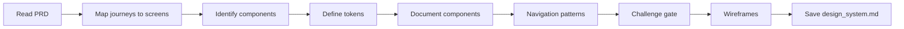

# Design System

## Goal

Create a coherent and reusable set of UI/UX patterns, components, and guidelines based on the product's user journeys and personas.

## Rules

- Components must be derived from actual user journeys, not invented
- Accessibility WCAG AA is mandatory, not optional
- Reuse before creating: check if an existing component can be adapted
- Design tokens (colors, typography, spacing) must be defined before components
- Requirements started from $ARGUMENTS

### Scope Boundary

**In scope: visual patterns ONLY** — tokens, component structure, variants, states, layouts, navigation patterns, wireframes.

**Out of scope** (owned by other deliverables):
- Error message catalogues, exact user-facing text → `ux_copy.md`
- Exact prompt/tooltip/CTA wording → `ux_copy.md`
- Detailed ARIA roles, keyboard navigation sequences, focus management rules → `accessibility_spec.md`

When documenting component states (error, empty, loading), describe the **structural pattern** (e.g., "displays an error banner with icon + message + retry action") without writing the exact copy.

## Quick Start

```text
Create a design system from our PRD
```

## Workflow



### Step 1: Map Journeys

**Do:**

1. Read the PRD and extract user journeys from $ARGUMENTS or referenced files
2. Map each journey to required screens and interactions
3. Identify recurring components across journeys (buttons, inputs, cards, tables, modals)

**Success criteria:** All journeys mapped to screens, recurring components identified

### Step 2: Define Design Tokens

**Do:**

1. Read the template from Resources. Follow its exact structure — same headings, same table columns, same formats. Do not add, remove, or rename sections.
2. Define all design tokens following the template. All token categories are mandatory.

**Success criteria:** All template token categories defined with accessibility compliance

### Step 3: Document Components

**Do:**

1. For each component, document all aspects from the template (variants, states, accessibility)
2. Define navigation patterns

**Success criteria:** Each component fully documented per template, navigation patterns defined

### Step 4: Challenge Gate

**Do:**

1. Read the template from Resources
2. Verify every template section exists in the output with the exact same heading name and no section was added beyond what the template defines
3. Verify format requirements:
   - WCAG AA contrast ratios documented per color token

**Success criteria:** All template sections present and format requirements met. If any section is missing or any format is wrong, STOP — fix it. Do NOT proceed until structurally complete.

### Step 5: Wireframes & Save

**Do:**

1. Create wireframes for key MVP screens (main view, critical form, empty state, error state)
2. Save as `{{DOCS}}/memory/internal/design_system.md`

**Success criteria:** Wireframes created, file saved and accessible

## Resources

| Type     | Path                                      | Description          |
| -------- | ----------------------------------------- | -------------------- |
| Input    | `{{DOCS}}/memory/internal/prd.md`         | Product requirements |
| Template | `{{DOCS}}/templates/ux/design_system.md`  | Design system template |
