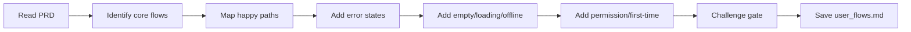

# User Flow Map

## Goal

Produce a complete map of user flows covering every state: happy path, error, empty, loading, permission denied, offline, and first-time experience. The output ensures no interaction state is forgotten before development starts.

## Rules

- Every flow must cover ALL states: happy, error, empty, loading, permission, offline, first-time
- Flows must be derived from the PRD — no invented features
- Each decision point must document both branches (success and failure)
- Edge cases are not optional — they are the main deliverable
- Requirements started from $ARGUMENTS

### Scope Boundary

**Document transitions, not copy.** For each state, document the **type of response** (error, confirmation, redirect) and the **recovery path**, but not the exact user-facing text. Exact wording is owned by `ux_copy.md`.

- **DO:** "Error → actionable error message on stderr with recovery guidance"
- **DON'T:** "Error → `Authentication failed. Run gh auth login to authenticate, or provide a token via --token or AIDD_TOKEN.`"
- The exact text is owned by `ux_copy.md`. Here, document WHAT type of response and HOW to recover, not the exact wording.

## Quick Start

```text
Map user flows from our PRD
```

## Workflow



### Step 1: Identify Core Flows

**Do:**

1. Read the PRD and user stories from $ARGUMENTS or referenced files
2. List all distinct user flows (registration, onboarding, core feature usage, settings, etc.)
3. For each flow, identify entry points and exit points

**Success criteria:** All flows from the PRD are listed with entry/exit points

### Step 2: Map Happy Paths

**Do:**

1. Read the template from Resources. Follow its exact structure — same headings, same table columns, same formats. Do not add, remove, or rename sections.
2. For each flow, document the happy path step by step
3. Include screen transitions, user actions, and system responses
4. Use Mermaid flowcharts to visualize each flow

**Success criteria:** Every flow has a complete happy path documented

### Step 3: Add All States

**Do:**

1. For each step in each flow, document:
   - **Error state**: What happens when the action fails? (network error, validation error, server error)
   - **Empty state**: What does the user see when there is no data?
   - **Loading state**: What feedback does the user get while waiting?
   - **Permission denied**: What happens if the user lacks access?
   - **Offline state**: What is available without connectivity?
   - **First-time experience**: What does a new user see vs a returning user?
2. Document recovery paths for each error state

**Success criteria:** Every step in every flow has all 6 states documented

### Step 4: Challenge Gate

**Do:**

1. Read the template from Resources
2. Verify every template section exists in the output with the exact same heading name and no section was added beyond what the template defines
3. Verify format requirements:
   - State tables use response types, not exact copy
   - Mermaid flowcharts present for each flow

**Success criteria:** All template sections present and format requirements met. If any section is missing or any format is wrong, STOP — fix it. Do NOT proceed until structurally complete.

### Step 5: Save

**Do:**

1. Save as `{{DOCS}}/memory/internal/user_flows.md`

**Success criteria:** File saved and accessible

## Resources

| Type     | Path                                          | Description          |
| -------- | --------------------------------------------- | -------------------- |
| Input    | `{{DOCS}}/memory/internal/prd.md`             | Product requirements |
| Input    | `{{DOCS}}/memory/internal/user_stories.md`    | User stories         |
| Template | `{{DOCS}}/templates/ux/user_flows.md`         | User flows template  |
