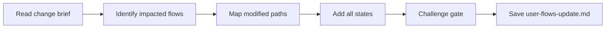

# Update User Flows

## Goal

Map only the user flows impacted by the change, covering all states: happy path, error, empty, loading, permission denied, offline, and first-time. The output ensures no interaction state is forgotten for the modified flows.

## Rules

- **Change-scoped** — only map flows that are new or modified by the change brief, not the full product
- Every mapped flow must cover ALL states: happy, error, empty, loading, permission, offline, first-time
- Each decision point must document both branches (success and failure)
- **Preservation awareness** — explicitly note where modified flows connect to preserved (unchanged) flows
- **Document transitions, not copy** — document the TYPE of response and RECOVERY path, not exact user-facing text (owned by ux-copywriting-update)
- Requirements started from $ARGUMENTS

## Quick Start

```text
Map the impacted user flows for the login redesign change
```

## Workflow



### Step 1: Identify Impacted Flows

**Do:**

1. Read change brief and system overview from Resources
2. If existing user_flows.md exists, read it for context on current flow structure
3. List all flows impacted by the change:
   - **New flows**: entirely new user journeys introduced by the change
   - **Modified flows**: existing flows where steps change
   - **Removed flows**: flows that no longer exist after the change
4. For modified flows, identify which steps change and which are preserved
5. Note connection points where modified flows meet unchanged flows

**Success criteria:** Complete inventory of impacted flows with change classification

### Step 2: Map Modified Paths with All States

**Do:**

1. For each impacted flow, document:
   - Entry point and exit point
   - Happy path step by step (only the changed portion, with connection points to preserved flows)
   - Screen transitions, user actions, system responses
   - Use Mermaid flowcharts to visualize
2. For each step in each impacted flow, document all states:
   - **Error**: what happens when action fails?
   - **Empty**: what does user see with no data?
   - **Loading**: what feedback while waiting?
   - **Permission denied**: what if user lacks access?
   - **Offline**: what's available without connectivity?
   - **First-time**: new user vs returning user variant
3. Document recovery paths for each error state

**Success criteria:** All impacted flows mapped with all 7 states, connection points to unchanged flows documented

### Step 3: Challenge Gate

**Do:**

1. Verify all sections present:
   - Impacted flow inventory with classification (new/modified/removed)
   - Mermaid flowcharts for each impacted flow
   - State tables for each flow step (all 7 states)
   - Recovery paths for errors
   - Connection points to preserved flows
2. Verify format: state tables use response types (not exact copy), Mermaid flowcharts present

**Success criteria:** All sections present and format requirements met. If any section is missing or format is wrong, STOP — fix it.

### Step 4: Save

**Do:**

1. Save as `{{DOCS}}/tasks/YYYY-MM-DD-{change-name}/user-flows-update.md`

**Success criteria:** File saved and accessible

## Resources

| Type     | Path                                          | Description                            |
| -------- | --------------------------------------------- | -------------------------------------- |
| Input    | Change brief from current task folder         | Change scope and rationale             |
| Input    | `{{DOCS}}/memory/internal/system_overview.md` | Current system state                   |
| Input    | `{{DOCS}}/memory/internal/user_flows.md`      | Existing user flows (if available)     |
| Template | `{{DOCS}}/templates/ux/user_flows.md`         | User flows template (section structure)|
